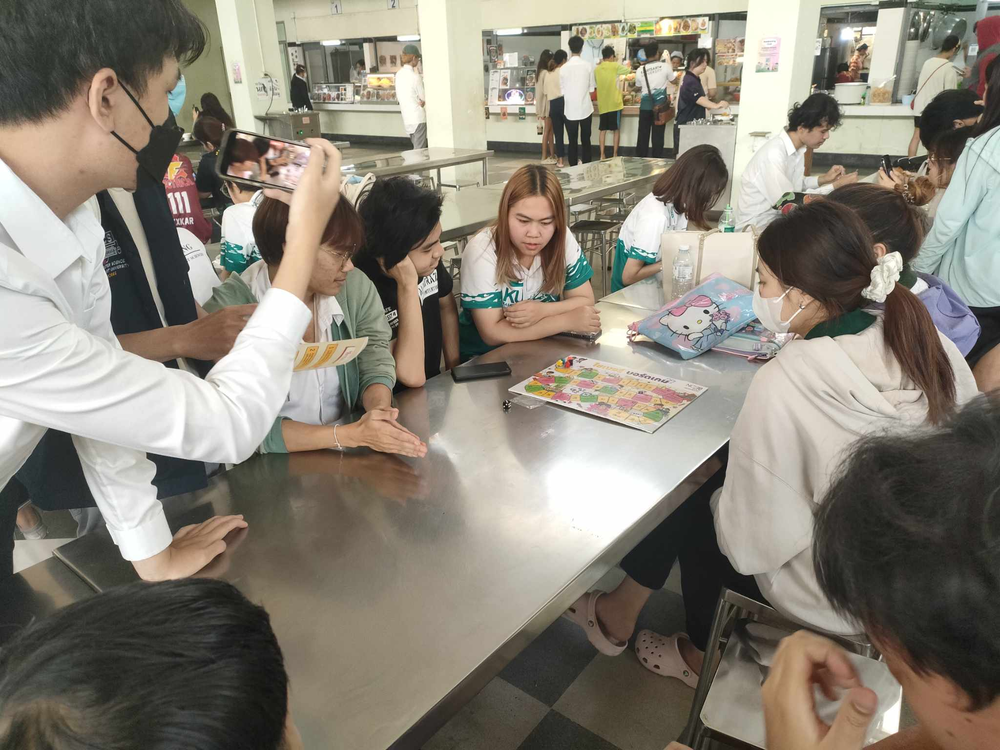
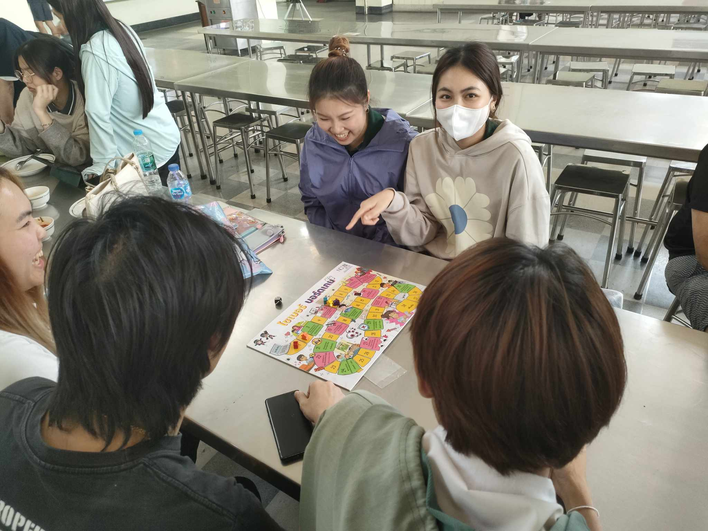
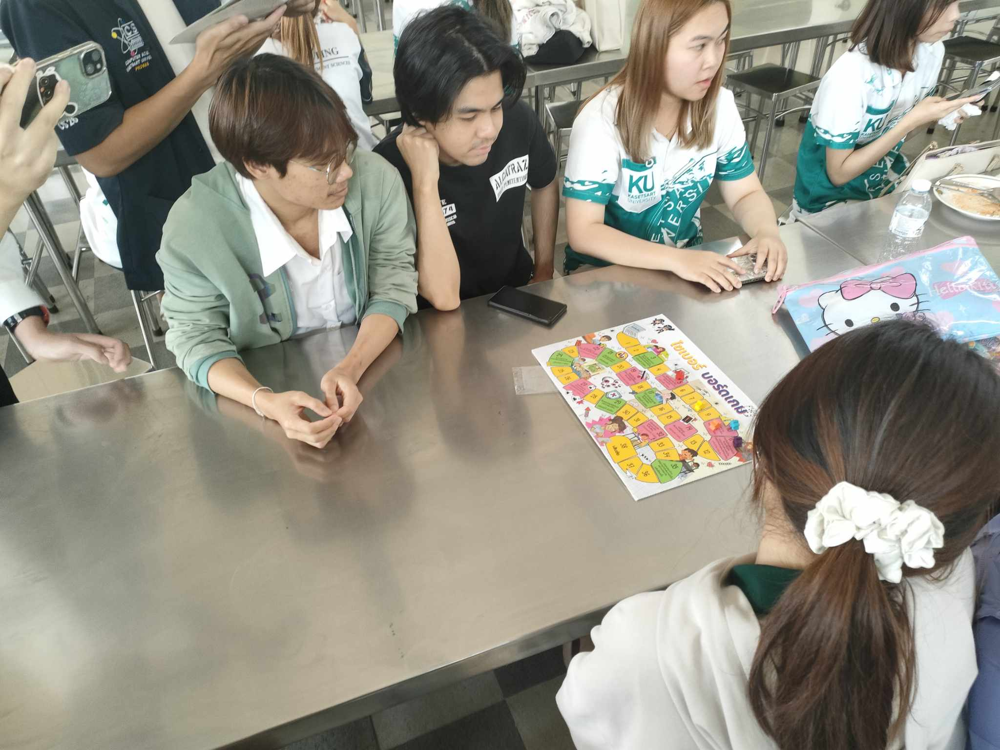
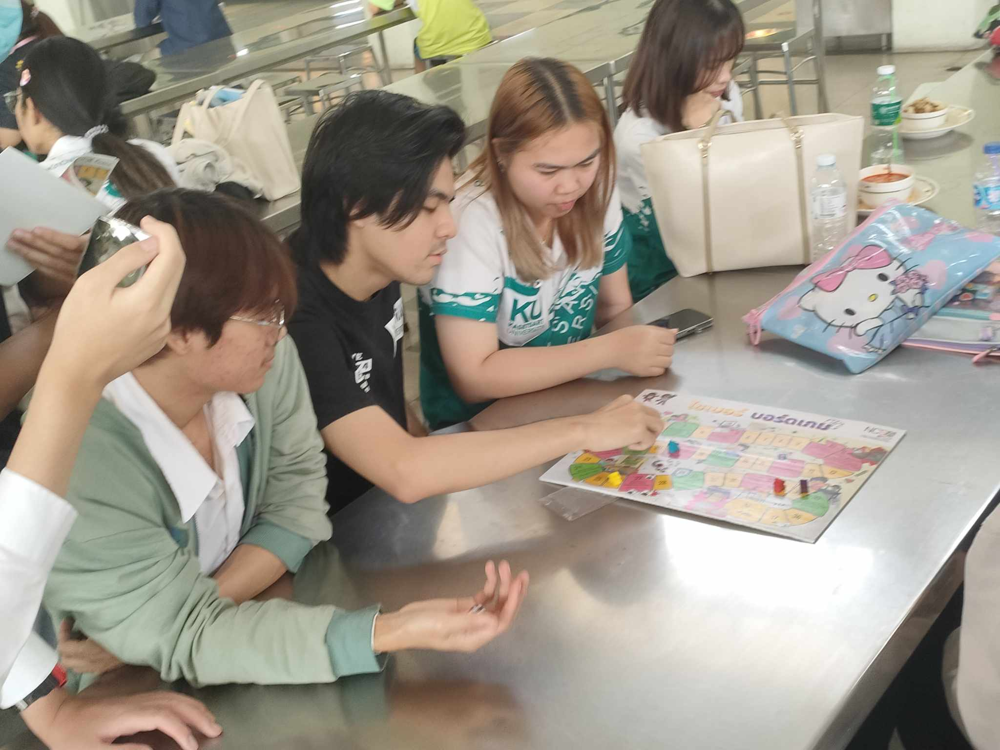
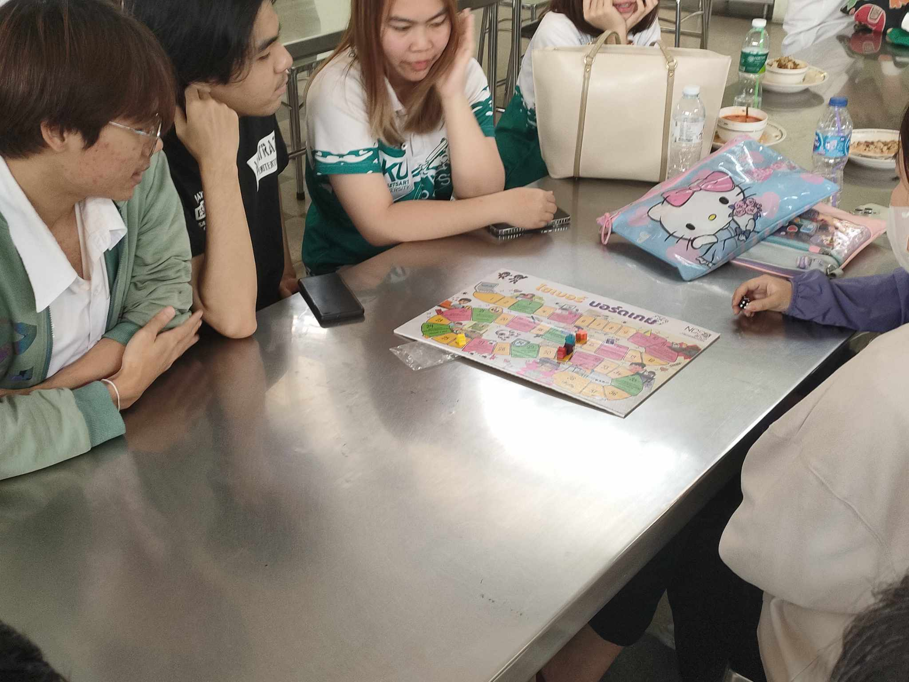
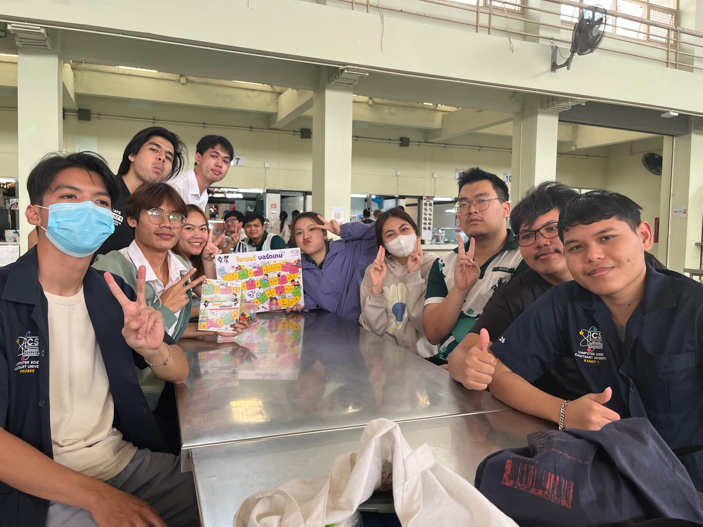

### Board Game Cyber Security
 - ### บรรยากาศภายในการทำกิจกรรมการเล่นบอร์ดเกมของสำนักงานคณะกรรมการการรักษาความมั่นคงปลอดภัยไซเบอร์แห่งชาติ(สกมช. หรือ NCSA)
   - กิจกรรมบอร์ดเกมเพื่อความปลอดภัยไซเบอร์ จัดขึ้นโดยสำนักงานคณะกรรมการการรักษาความมั่นคงปลอดภัยไซเบอร์แห่งชาติ (NCSA) มีผู้เข้าร่วมจากสาขาวิชาวิทยาการคอมพิวเตอร์อย่างกระตือรือร้น ตัวบอร์ดเกมถูกออกแบบให้มีความรู้ด้าน Cybersecurity แทรกอยู่ในรูปแบบช่องพิเศษ ทำให้ผู้เล่นได้รับทั้งความสนุกและความรู้ไปพร้อมกัน ผู้เข้าร่วมส่วนใหญ่ให้ความเห็นว่าเป็นครั้งแรกที่ได้สัมผัสกับหัวข้อนี้ และการเล่นเกมนี้ช่วยให้พวกเขาเข้าใจและสนใจในเรื่องความปลอดภัยไซเบอร์มากยิ่งขึ้น บรรยากาศเป็นกันเอง มีการแลกเปลี่ยนมุมมองและความคิดเห็นตลอดช่วงกิจกรรม
 - ### สถานที่ทำกิจกรรม : โรงอาหารภายในมหาวิทยาลัยเกษตรศษสตร์ วิทยาเขตศรีราชา
 - ### วันที่ 23 มกราคม 2025
 - ### Player
   - นักศึกษาปี 3 คณะวิทยาการจัดการ สาขาบัญชี
   - จำนวน 3 คน
   - staff 2 คน

 - ### Youtube!!!

 - ### -Members-
1.[Kittithorn](https://kitty340822.github.io/boardgame)

2.[Jetnipat](https://jetnipatmark.github.io/boardgame)

3.[Kasidit](https://kasidit1647.github.io/boardgame)

4.[Suraphak](https://titigerherb.github.io/boardgame)

5.[Purin](https://phaipy.github.io/boardgame)

6.[Phuriphat](https://prxsss.github.io/boardgame)
